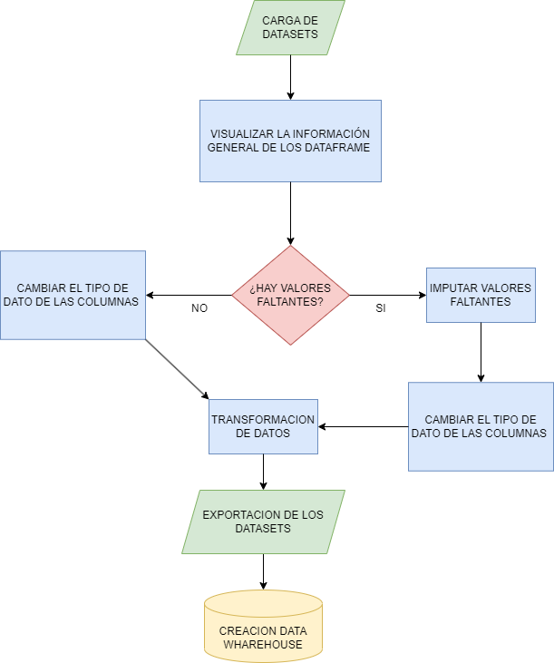

 

# PROYECTO INDIVIDUAL I

DESCRIPCION DEL PROYECTO  
En este proyecto realizaremos un proceso de ETL (Extract, Transform, Load) para distintos dataset que se enfocan en un mismo modelo de negocios. Estos datasets provienen de diversas fuentes de datos de revelamiento de precios en distintos mercados. 

Nuestro obejtivo principal sera realizar una correcta carga de todos los datasets en un mismo tipo de archivo, limpiar cada uno de estos datasets y realizar una carga incremental de estos dataset en una BASE DE DATOS  

Dividiremos el proyecto en diferentes fases que nos permitiran realizar correctamente el proceso de ETL, adicionalmente a esto utilizaremos AIRFLOW para realizar la carga incremental para automatizar el proceso. 

DESCRIPCION DE LOS DATASETS
* Precios_semana_20200413.csv: Contiene 3 dimensiones y 472166 registros, contiene informacion sobre el precio del producto, su ID y la sucursal donde fue vendido. Tipo : csv
* Precios_semana_20200503.json: Contiene 3 dimensiones y 397734 registros, contiene informacion sobre el precio del producto, su ID y la sucursal donde fue vendido. Tipo : json
* precios_semana_20200518.txt: Contiene 3 dimensiones y 415293 registros, contiene informacion sobre el precio del producto, su ID y la sucursal donde fue vendido. Tipo : txt
* Precios_semanas_20200419_20200426.xlsx: Contiene dos datasets, Precios_semanas_20200426, Contiene 3 dimensiones y 477173 registros, Precios_semanas_20200419 Contiene 3 dimensiones y 456736 registros, cada uno contiene informacion sobre el precio del producto, su ID y la sucursal donde fue vendido. Tipo : xlsx (excel)
* Producto.parquet: Contiene 7 dimensiones y 72038 registros, contiene informacion sobre el producto, su ID, marca. nombre, presentación, y categorias. Tipo : parquet
* Sucursal: Contiene 12 dimensiones y 2333 registros, contiene informacion sobre la sucursal, su ID, su Id de comercio, sus banderas, razon social, provincia, localidad, latitud, longitud, direccion, nombre y tipo de sucursal. Tipo : csv

FASES DEL PROYECTO
1. Carga de los datasets

2. Visualizar la informacion general de los datasets, sus valores nulos, tipo de datos, etc. 

3. Transformacion de los datos

4. Crear la base de datos e importar los datasets en las tablas

5. Realizar la carga incremental

6. Realizamos la consulta requerida en este modelo de negocios = ¿Cuál es el precio promedio de la sucursal 9-1-688

* PLUS: Tanto en python como en MySql hay unos plus que permitiran automatizar un poco el proceso de carga de datos.

-----------------------------------------------------------------------------------------------------------
 DIAGRAMA DE FLUJO  

Frameworks usados
+ `Python`: Proceso de ETL 
+ `MySql Workbench`: Base de datos y carga incremental
